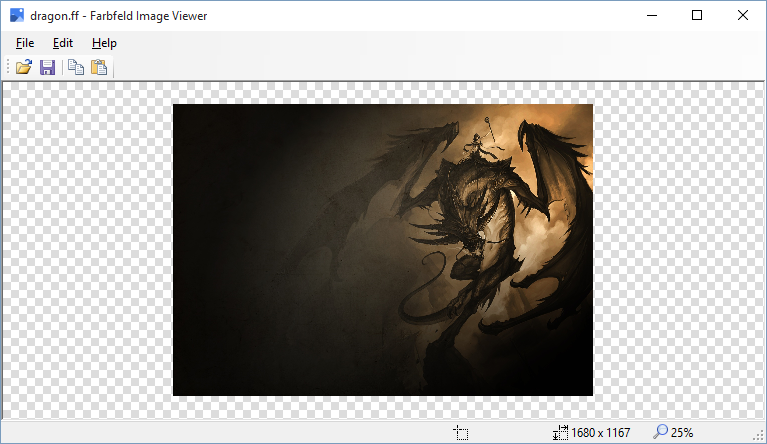

Cyotek.Drawing.Imaging.Farbfeld
===============================

About farbfeld
--------------

[farbfeld](http://tools.suckless.org/farbfeld/) by [suckless.org](http://suckless.org/) is a lossless image format which is easy to parse, pipe and compress. It has the following format:

| Bytes  | Description                                               |
| -----: | --------------------------------------------------------- |
| 8      | "farbfeld" magic value                                    |
| 4      | 32-Bit BE unsigned integer (width)                        |
| 4      | 32-Bit BE unsigned integer (height)                       |
| [2222] | 4x16-Bit BE unsigned integers [RGBA] / pixel, row-aligned |

The RGB-data should be sRGB for best interoperability and not alpha-premultiplied.

About Cyotek.Drawing.Imaging.Farbfeld
-------------------------------------

**Cyotek.Drawing.Imaging.Farbfeld** is a library for processing farbfeld files in .NET. There's a bit of background information on why I created this library on the [cyotek.com blog](http://www.cyotek.com/blog/reading-and-writing-farbfeld-images-using-csharp).

Using the library
-----------------

There are two static classes, `FarbfeldDecoder` and `FarbfeldEncoder` for saving and loading .NET `Bitmap` objects in the farbfeld format, along with a helper object `FarbfeldImageData` for holding the data without having to mess around with `Bitmap` objects (although can can use those to).

### FarbfeldDecoder

* `Decode(string)` - reads a farbfeld image from a file and creates a `FarbfeldImageData` object from the data
* `Decode(Stream)` - reads a farbfeld image from a Stream and creates a `FarbfeldImageData` from the data
* `IsFarbfeldImage(string)` - tests if the given file contains a farbfeld image
* `IsFarbfeldImage(Stream)` - tests if the given Stream contains a farbfeld image

### FarbfeldEncoder

* `Encode(string, Bitmap)` - saves a `Bitmap` into the specified file using the farbfeld format
* `Encode(Stream, Bitmap)` - saves a `Bitmap` into the specified Stream using the farbfeld format
* `Encode(string, FarbfeldImageData)` - saves raw image data into the specified file using the farbfeld format
* `Encode(Stream, FarbfeldImageData)` - saves raw image data into the specified Stream using the farbfeld format

Sample Application
------------------

This repository also includes a simple image viewer (using the [ImageBox](https://github.com/cyotek/Cyotek.Windows.Forms.ImageBox) control of course!) that lets you open farbfeld images, or convert other basic image formats to farbfeld.

Sample Images
-------------

The sample images which I used for reference to ensure the encoding/decoding actually worked came from the [here](https://github.com/mehlon/farbfeld)

Tests
-----

There are some tests. However, they have only been tested on little-endian systems (ie Windows)... I suspect the thing is going to break on big-endian systems.

Nuget?
------

There's a package, but I haven't published it yet.

Acknowledgements
----------------

The icon used in the viewer program came from <https://www.iconfinder.com/icons/254234/image_icon#size=128>

The `polgyon.png`, `polygon.png.ff`, `yellow-1x1-semitransparent.png` and `yellow-1x1-semitransparent.png.ff` sample images came from <https://github.com/mehlon/farbfeld>